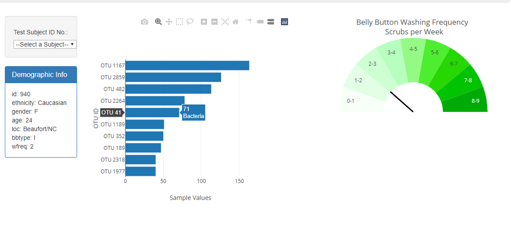
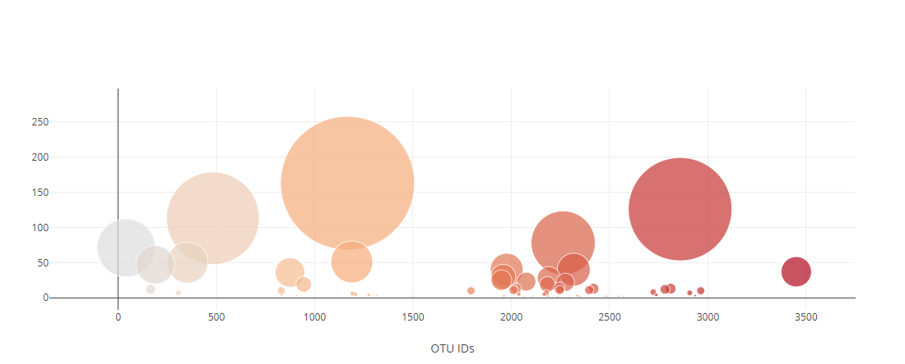
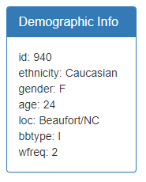
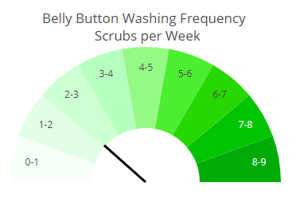

# Plot.ly - Belly Button Biodiversity Interactive Visualizations

Built an interactive dashboard to explore the [Belly Button Biodiversity dataset](http://robdunnlab.com/projects/belly-button-biodiversity/), which catalogs the microbes that colonize human navels.

The dataset reveals that a small handful of microbial species (also called operational taxonomic units, or OTUs, in the study) were present in more than 70% of people, while the rest were relatively rare.

### Technologies
1. **D3 Data Driven Documents: [https://d3js.org/](https://d3js.org/ "https://d3js.org/")**
2. **Plotly - [https://plot.ly/javascript/](https://plot.ly/javascript/ "Plotly Documentation")**
3. **HTML**
4. **Javascript**
5. **CSS**
6. **URL: [https://evansvillewy.github.io/Biodiversity-Visualizations/](https://evansvillewy.github.io/Biodiversity-Visualizations/ "https://evansvillewy.github.io/Biodiversity-Visualizations/")**

## Plotly Barchart

1. Used the D3 library to read in `samples.json`.

2. Created a horizontal bar chart with a dropdown menu to display the top 10 OTUs found in that individual.

* Used `sample_values` as the values for the bar chart.

* Used `otu_ids` as the labels for the bar chart.

* Used `otu_labels` as the hovertext for the chart.

  

## Plotly Bubble chart

3. Created a bubble chart that displays each sample.

* Used `otu_ids` for the x values.

* Used `sample_values` for the y values.

* Used `sample_values` for the marker size.

* Used `otu_ids` for the marker colors.

* Used `otu_labels` for the text values.

## Metadata

4. Displayed the sample metadata, i.e., an individual's demographic information.

5. Displayed each key-value pair from the metadata JSON object somewhere on the page.

6. The plots update when a new sample is selected.

## Plotly Wash Frequency Gauge

* Adapted the Gauge Chart from <https://plot.ly/javascript/gauge-charts/> to plot the weekly washing frequency of the individual.

* Modified the gauge code to account for values ranging from 0 through 9.

* The chart updates whenever a new sample is selected.

 

### About the Data

Hulcr, J. et al.(2012) _A Jungle in There: Bacteria in Belly Buttons are Highly Diverse, but Predictable_. Retrieved from: [http://robdunnlab.com/projects/belly-button-biodiversity/results-and-data/](http://robdunnlab.com/projects/belly-button-biodiversity/results-and-data/)

- - -

